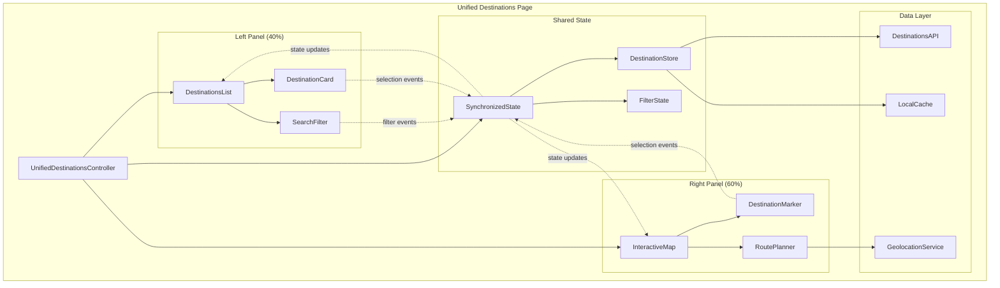
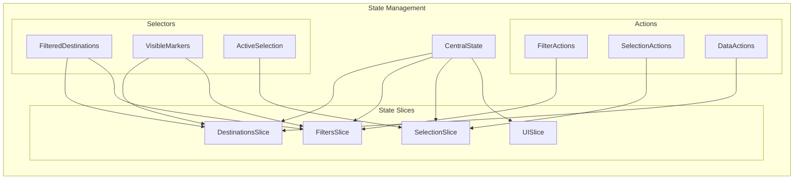
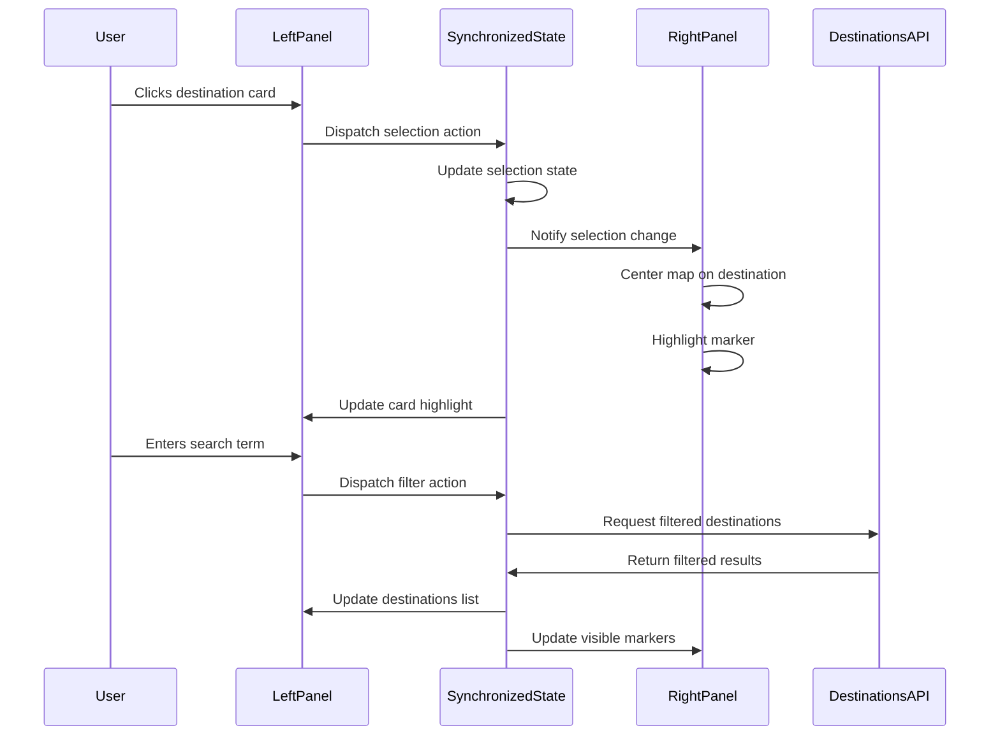
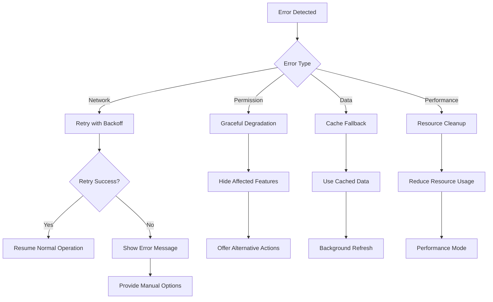

# Design Document: Unified Destinations Page

## Overview

The unified destinations page represents a significant architectural enhancement to the HeritageLink tourism platform, combining the existing `/destinations` and `/map` pages into a cohesive split-screen interface. This design enables tourists to simultaneously browse Gloria, Oriental Mindoro's heritage sites in a structured list format while visualizing their geographic locations on an interactive map.

The solution addresses the current user friction of switching between separate pages by providing a 40/60 split layout (destinations list/interactive map) that maintains full functionality from both original pages while adding synchronized interactions between panels. This approach reduces cognitive load and improves the destination discovery experience for tourists planning their visits.

Key design principles include:
- **Unified Experience**: Seamless integration of list and map views without navigation overhead
- **Synchronized State**: Real-time coordination between panels for search, filtering, and selection
- **Performance First**: Progressive loading and efficient data management for smooth interactions
- **Responsive Design**: Adaptive layouts that work across desktop, tablet, and mobile devices
- **Accessibility**: Full keyboard navigation and screen reader support throughout the interface

## Architecture

### High-Level System Architecture

The unified destinations page follows a component-based architecture with clear separation of concerns between presentation, state management, and data layers.



### Component Hierarchy

The application follows a hierarchical component structure that promotes reusability and maintainability:

**UnifiedDestinationsPage** (Root Container)
- **LeftPanel** (40% width container)
  - **SearchFilterBar** (Search and filter controls)
  - **DestinationsList** (Scrollable destinations container)
    - **DestinationCard** (Individual destination display)
    - **LoadingSpinner** (Progressive loading indicator)
- **RightPanel** (60% width container)
  - **InteractiveMap** (Map container with controls)
    - **DestinationMarker** (Map markers for destinations)
    - **RouteOverlay** (GPS route visualization)
    - **MapControls** (Zoom, location, layer controls)
- **DestinationDetailsModal** (Shared popup for detailed information)
- **ResponsiveLayoutManager** (Handles breakpoint adaptations)

### State Management Architecture

The application uses a centralized state management pattern with reactive updates:



**State Structure:**
- **DestinationsSlice**: Raw destination data, loading states, error handling
- **FiltersSlice**: Active search terms, category filters, sort preferences
- **SelectionSlice**: Currently selected destination, highlight states
- **UISlice**: Panel visibility, modal states, responsive breakpoints

## Components and Interfaces

### Core Components

#### UnifiedDestinationsController

The main orchestrator component that manages the split-screen layout and coordinates between panels.

**Interface:**
```typescript
interface UnifiedDestinationsController {
  // Layout management
  leftPanelWidth: number; // Default 40%
  rightPanelWidth: number; // Default 60%
  isMobile: boolean;
  
  // State coordination
  synchronizeSelection(destinationId: string): void;
  synchronizeFilters(filters: FilterState): void;
  handleCrossPanelInteraction(event: InteractionEvent): void;
  
  // Responsive behavior
  handleBreakpointChange(breakpoint: Breakpoint): void;
  toggleMobileLayout(): void;
}
```

**Responsibilities:**
- Manage split-screen layout proportions and responsive behavior
- Coordinate state synchronization between left and right panels
- Handle cross-panel interaction events and update both panels accordingly
- Manage mobile layout transitions (horizontal to vertical stacking)

#### LeftPanel Components

**DestinationsList**
```typescript
interface DestinationsList {
  destinations: Destination[];
  displayMode: 'grid' | 'list';
  sortBy: 'name' | 'distance' | 'rating' | 'category';
  selectedDestination: string | null;
  
  onDestinationSelect(destinationId: string): void;
  onDisplayModeChange(mode: DisplayMode): void;
  onSortChange(sortBy: SortOption): void;
}
```

**SearchFilterBar**
```typescript
interface SearchFilterBar {
  searchTerm: string;
  activeFilters: CategoryFilter[];
  availableCategories: Category[];
  
  onSearchChange(term: string): void;
  onFilterToggle(filter: CategoryFilter): void;
  onClearFilters(): void;
}
```

#### RightPanel Components

**InteractiveMap**
```typescript
interface InteractiveMap {
  center: Coordinates;
  zoom: number;
  markers: DestinationMarker[];
  selectedMarkerId: string | null;
  routeOverlay: RouteData | null;
  
  onMarkerClick(markerId: string): void;
  onMapMove(center: Coordinates, zoom: number): void;
  onRouteRequest(destinationId: string): void;
}
```

**DestinationMarker**
```typescript
interface DestinationMarker {
  id: string;
  position: Coordinates;
  title: string;
  category: Category;
  isSelected: boolean;
  isHighlighted: boolean;
  
  onClick(): void;
  onHover(): void;
}
```

### Data Interfaces

#### Core Data Models

**Destination**
```typescript
interface Destination {
  id: string;
  name: string;
  description: string;
  category: Category;
  coordinates: Coordinates;
  images: ImageData[];
  rating: number;
  reviewCount: number;
  openingHours: OpeningHours;
  contactInfo: ContactInfo;
  amenities: Amenity[];
  distanceFromUser?: number;
}
```

**FilterState**
```typescript
interface FilterState {
  searchTerm: string;
  categories: Category[];
  sortBy: SortOption;
  sortOrder: 'asc' | 'desc';
  priceRange?: PriceRange;
  ratingMin?: number;
}
```

**SelectionState**
```typescript
interface SelectionState {
  selectedDestinationId: string | null;
  highlightedDestinationId: string | null;
  showDetails: boolean;
  detailsSource: 'list' | 'map';
}
```

### API Interfaces

**DestinationsAPI**
```typescript
interface DestinationsAPI {
  getAllDestinations(): Promise<Destination[]>;
  getDestinationById(id: string): Promise<Destination>;
  searchDestinations(query: SearchQuery): Promise<Destination[]>;
  getDestinationsByCategory(category: Category): Promise<Destination[]>;
  getNearbyDestinations(coordinates: Coordinates, radius: number): Promise<Destination[]>;
}
```

**GeolocationService**
```typescript
interface GeolocationService {
  getCurrentPosition(): Promise<Coordinates>;
  calculateDistance(from: Coordinates, to: Coordinates): number;
  getDirections(from: Coordinates, to: Coordinates): Promise<RouteData>;
  planMultiDestinationRoute(destinations: Coordinates[]): Promise<RouteData>;
}
```

## Data Models

### Primary Entities

#### Destination Entity
```typescript
interface Destination {
  // Core identification
  id: string;
  slug: string;
  name: string;
  shortDescription: string;
  fullDescription: string;
  
  // Geographic data
  coordinates: {
    latitude: number;
    longitude: number;
  };
  address: {
    street?: string;
    barangay: string;
    municipality: string; // "Gloria"
    province: string; // "Oriental Mindoro"
    postalCode?: string;
  };
  
  // Classification
  category: {
    id: string;
    name: string;
    icon: string;
    color: string;
  };
  subcategories: string[];
  tags: string[];
  
  // Media and presentation
  images: {
    id: string;
    url: string;
    alt: string;
    caption?: string;
    isPrimary: boolean;
    order: number;
  }[];
  
  // User engagement data
  rating: {
    average: number;
    count: number;
    distribution: {
      1: number;
      2: number;
      3: number;
      4: number;
      5: number;
    };
  };
  
  // Operational information
  openingHours: {
    [day: string]: {
      open: string;
      close: string;
      isClosed: boolean;
    };
  };
  seasonalHours?: {
    season: string;
    startDate: string;
    endDate: string;
    hours: OpeningHours;
  }[];
  
  // Contact and accessibility
  contactInfo: {
    phone?: string;
    email?: string;
    website?: string;
    socialMedia?: {
      facebook?: string;
      instagram?: string;
    };
  };
  
  // Features and amenities
  amenities: {
    id: string;
    name: string;
    icon: string;
    available: boolean;
  }[];
  
  accessibility: {
    wheelchairAccessible: boolean;
    hasParking: boolean;
    hasRestrooms: boolean;
    guidedToursAvailable: boolean;
  };
  
  // Pricing information
  pricing: {
    entranceFee?: {
      adult: number;
      child: number;
      senior: number;
      currency: string;
    };
    isFree: boolean;
    notes?: string;
  };
  
  // Metadata
  createdAt: string;
  updatedAt: string;
  isActive: boolean;
  featured: boolean;
  
  // Computed fields (calculated at runtime)
  distanceFromUser?: number;
  travelTime?: {
    walking?: number;
    driving?: number;
  };
}
```

#### Filter and Search Models
```typescript
interface SearchQuery {
  term: string;
  categories: string[];
  tags: string[];
  location?: {
    center: Coordinates;
    radius: number; // in kilometers
  };
  priceRange?: {
    min: number;
    max: number;
  };
  rating?: {
    min: number;
  };
  amenities: string[];
  accessibility?: {
    wheelchairAccessible?: boolean;
    hasParking?: boolean;
  };
}

interface SortOptions {
  field: 'name' | 'distance' | 'rating' | 'category' | 'created';
  order: 'asc' | 'desc';
}
```

#### UI State Models
```typescript
interface UIState {
  layout: {
    leftPanelWidth: number;
    rightPanelWidth: number;
    isMobile: boolean;
    isVerticalStack: boolean;
  };
  
  leftPanel: {
    displayMode: 'grid' | 'list';
    itemsPerPage: number;
    currentPage: number;
    scrollPosition: number;
  };
  
  rightPanel: {
    mapCenter: Coordinates;
    mapZoom: number;
    mapStyle: 'standard' | 'satellite' | 'terrain';
    showTraffic: boolean;
    showRoute: boolean;
  };
  
  selection: {
    selectedDestinationId: string | null;
    highlightedDestinationId: string | null;
    showDetailsModal: boolean;
    detailsModalSource: 'list' | 'map';
  };
  
  loading: {
    destinations: boolean;
    search: boolean;
    route: boolean;
  };
  
  errors: {
    destinations?: string;
    geolocation?: string;
    route?: string;
  };
}
```

### Data Flow Architecture



## Correctness Properties

*A property is a characteristic or behavior that should hold true across all valid executions of a system-essentially, a formal statement about what the system should do. Properties serve as the bridge between human-readable specifications and machine-verifiable correctness guarantees.*

After analyzing the acceptance criteria, I've identified several key properties that can be consolidated to eliminate redundancy while maintaining comprehensive coverage:

### Property 1: Responsive Layout Adaptation

*For any* viewport size, the split-screen layout should adapt appropriately, maintaining usability and proper proportions across desktop, tablet, and mobile breakpoints.

**Validates: Requirements 1.4, 6.2**

### Property 2: Synchronized Search and Filter Operations

*For any* search term or filter combination, both the destinations list and map markers should display identical filtered results simultaneously.

**Validates: Requirements 2.2, 2.3, 2.4**

### Property 3: Filter Clear Round-Trip

*For any* applied filter state, clearing all filters should restore the complete set of destinations in both panels, returning to the original unfiltered state.

**Validates: Requirements 2.5**

### Property 4: Cross-Panel Selection Synchronization

*For any* destination selection (whether from list or map), both panels should update their selection state and visual indicators simultaneously, maintaining consistent selection across the interface.

**Validates: Requirements 3.1, 3.2, 3.4, 3.5**

### Property 5: Selection Triggers Details Display

*For any* destination selected in either panel, the system should display destination details in a popup or overlay.

**Validates: Requirements 3.3**

### Property 6: Complete Marker Representation

*For any* set of destinations, every destination should have a corresponding interactive marker displayed on the map.

**Validates: Requirements 4.1**

### Property 7: Marker Interaction Feedback

*For any* destination marker clicked on the map, the system should display destination information in a popup.

**Validates: Requirements 4.2**

### Property 8: Route Planning Functionality

*For any* selected destination or set of destinations, the route planner should calculate and display GPS directions with route lines on the map.

**Validates: Requirements 4.3, 4.4**

### Property 9: Destination Card Information Completeness

*For any* destination, the destination card should display all required information including images, names, descriptions, ratings, and key details.

**Validates: Requirements 5.1**

### Property 10: Sorting Correctness

*For any* sort option (name, distance, rating, category), the destinations list should display results in the correct order according to the selected criteria.

**Validates: Requirements 5.2**

### Property 11: Display Mode Toggle

*For any* display mode selection (grid or list), the destinations list should render in the appropriate layout format.

**Validates: Requirements 5.3**

### Property 12: Progressive Loading Behavior

*For any* large dataset of destinations, the system should implement progressive loading (infinite scroll or pagination) to maintain performance.

**Validates: Requirements 5.4**

### Property 13: Distance Calculation Display

*For any* destination when location services are enabled, the system should calculate and display the distance from the user's current location.

**Validates: Requirements 5.5**

### Property 14: Progressive Marker Loading

*For any* large dataset of destinations, map markers should load progressively to maintain performance.

**Validates: Requirements 6.4**

### Property 15: Data Consistency Between Panels

*For any* destination, identical information should be displayed in both the left panel list and right panel map representations.

**Validates: Requirements 7.1**

### Property 16: Synchronized Data Updates

*For any* destination data update, both panels should refresh simultaneously to reflect the changes.

**Validates: Requirements 7.2**

### Property 17: Operation Synchronization Maintenance

*For any* operation (selection, filtering, sorting), cross-panel synchronization should be maintained throughout the interaction.

**Validates: Requirements 7.3**

### Property 18: Unavailable Destination Status Display

*For any* destination marked as temporarily unavailable, both panels should indicate this status consistently.

**Validates: Requirements 7.4**

### Property 19: Local Data Caching

*For any* destination data accessed, the system should cache the information locally to support smooth panel interactions.

**Validates: Requirements 7.5**

### Property 20: Keyboard Navigation Accessibility

*For any* keyboard navigation sequence, users should be able to access both panels with proper tab order and focus management.

**Validates: Requirements 8.1, 8.5**

### Property 21: Alternative Text Completeness

*For any* destination image or map element, appropriate alternative text should be provided for accessibility.

**Validates: Requirements 8.2**

### Property 22: Keyboard-Only Search Operation

*For any* search or filter operation, the functionality should be fully operable using keyboard navigation only.

**Validates: Requirements 8.3**

### Property 23: Screen Reader Announcements

*For any* cross-panel interaction or destination selection, appropriate announcements should be provided for screen readers.

**Validates: Requirements 8.4**

## Error Handling

### Error Categories and Strategies

#### Network and API Errors

**Destination Loading Failures**
- **Strategy**: Implement exponential backoff retry mechanism with user notification
- **Fallback**: Display cached destinations if available, show "offline mode" indicator
- **User Experience**: Non-blocking error messages with retry options

**Search API Timeouts**
- **Strategy**: Client-side filtering fallback for basic search operations
- **Timeout**: 5-second timeout with graceful degradation
- **User Feedback**: Loading indicators with timeout warnings

**Route Planning Failures**
- **Strategy**: Fallback to external mapping service integration (Google Maps, Apple Maps)
- **Error Recovery**: Provide alternative route options or manual directions
- **User Options**: "Open in external app" buttons for navigation

#### Geolocation Errors

**Permission Denied**
- **Strategy**: Graceful degradation without location-based features
- **Alternative**: Allow manual location input for distance calculations
- **User Guidance**: Clear explanation of location benefits with re-permission option

**Location Unavailable**
- **Strategy**: Disable distance-based sorting and filtering
- **Fallback**: Use default sorting by name or rating
- **User Experience**: Hide location-dependent UI elements

#### Data Synchronization Errors

**Panel Desynchronization**
- **Detection**: Implement state consistency checks between panels
- **Recovery**: Automatic resynchronization with user notification
- **Prevention**: Atomic state updates with rollback capability

**Cache Corruption**
- **Strategy**: Automatic cache invalidation and refresh
- **Recovery**: Force reload from API with loading indicators
- **User Impact**: Minimal disruption with background refresh

#### Performance and Resource Errors

**Memory Exhaustion**
- **Prevention**: Implement virtual scrolling for large destination lists
- **Mitigation**: Progressive marker clustering on map
- **Recovery**: Automatic cleanup of unused resources

**Slow Network Conditions**
- **Adaptation**: Reduce image quality and implement lazy loading
- **Prioritization**: Load critical data first (destination names, locations)
- **User Control**: Provide "data saver" mode option

### Error Recovery Patterns



## Testing Strategy

### Dual Testing Approach

The unified destinations page requires both unit testing and property-based testing to ensure comprehensive coverage and correctness validation.

**Unit Testing Focus:**
- Specific UI component rendering and interaction examples
- Edge cases for responsive breakpoints (exactly 768px width)
- Error condition handling and recovery scenarios
- Integration points between panels and external services
- Accessibility compliance verification

**Property-Based Testing Focus:**
- Universal behaviors across all destination datasets
- Cross-panel synchronization under various conditions
- Search and filter operations with randomized inputs
- Responsive layout adaptation across viewport ranges
- Data consistency validation between panels

### Property-Based Testing Configuration

**Testing Library**: Use fast-check (JavaScript/TypeScript) or Hypothesis (Python) for property-based testing
**Test Configuration**: Minimum 100 iterations per property test to ensure comprehensive input coverage
**Tagging Convention**: Each property test must reference its corresponding design document property

**Example Test Tags:**
- **Feature: unified-destinations-page, Property 2: For any search term or filter combination, both the destinations list and map markers should display identical filtered results simultaneously**
- **Feature: unified-destinations-page, Property 4: For any destination selection, both panels should update their selection state and visual indicators simultaneously**

### Unit Test Categories

**Component Rendering Tests**
- Verify split-screen layout structure (40/60 split)
- Confirm mobile vertical stacking at <768px breakpoint
- Validate search filter placement in left panel header
- Check map controls presence and functionality

**Integration Tests**
- Cross-panel selection synchronization
- Search and filter result consistency
- Route planning integration with map display
- Geolocation service integration

**Accessibility Tests**
- Keyboard navigation flow between panels
- Screen reader announcement verification
- Alternative text presence for all images
- Focus management during panel transitions

**Error Handling Tests**
- Network failure recovery scenarios
- Geolocation permission denial handling
- API timeout and retry mechanisms
- Cache corruption recovery procedures

### Performance Testing

**Load Testing Scenarios**
- Large destination datasets (1000+ destinations)
- Rapid search input changes (typing simulation)
- Multiple simultaneous route calculations
- Memory usage during extended browsing sessions

**Responsive Testing Matrix**
- Desktop: 1920x1080, 1366x768, 1024x768
- Tablet: 1024x768, 768x1024, 834x1194
- Mobile: 375x667, 414x896, 360x640

### Test Data Management

**Mock Data Generation**
- Randomized destination datasets with varied categories
- Geographic coordinate generation within Gloria, Oriental Mindoro bounds
- Realistic image URLs and metadata
- Varied rating distributions and review counts

**Test Environment Setup**
- Isolated component testing with mocked dependencies
- Integration testing with test API endpoints
- End-to-end testing with staging environment
- Performance testing with production-like data volumes

The testing strategy ensures that both specific examples and universal properties are validated, providing confidence in the system's correctness across all usage scenarios while maintaining performance and accessibility standards.